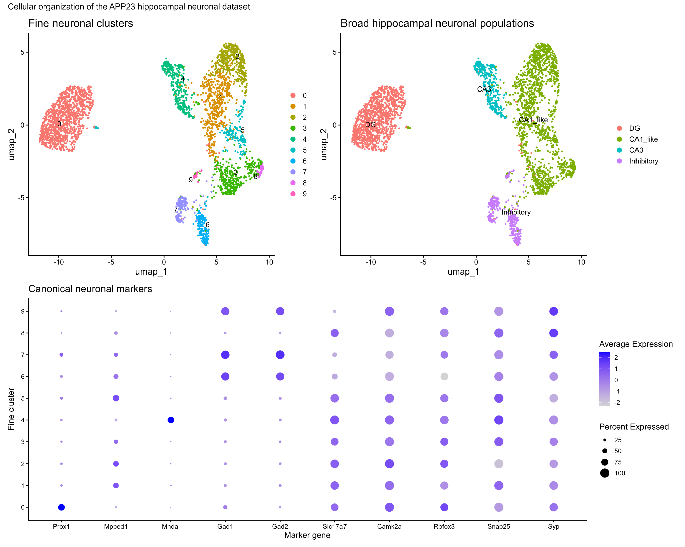
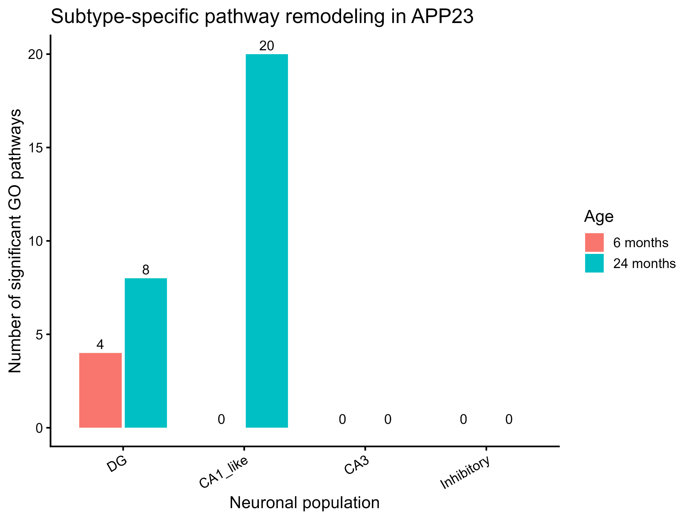
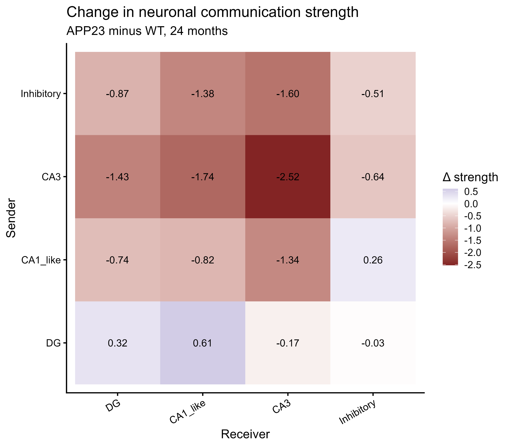
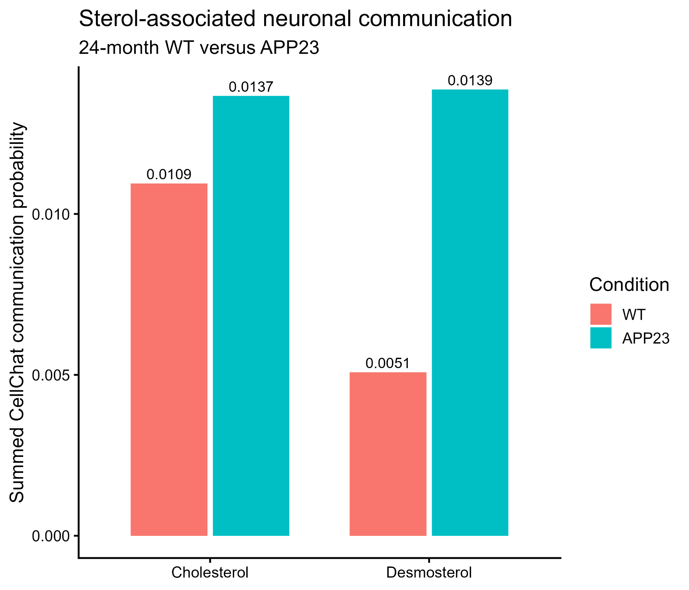

# APP23 hippocampal single-nucleus RNA-seq

**Age- and neuronal-subtype-dependent transcriptional remodeling in the APP23 mouse hippocampus**

Reproducible analysis of GEO dataset **GSE141044** using Seurat, mouse-level pseudobulk differential expression, ranked GO Biological Process GSEA, DoRothEA/decoupleR transcription-factor activity inference, and CellChat.

## Biological question

**Which hippocampal neuronal subtypes exhibit the strongest pathway-level transcriptional remodeling in APP23 mice, and which biological programs distinguish susceptible from relatively preserved neuronal populations?**

## Source dataset

- **GEO:** GSE141044
- **Organism:** *Mus musculus*
- **Dataset:** 3,280 neuronal nuclei from 11 biological samples
- **Ages:** 6 and 24 months
- **Genotypes:** WT and APP23
- **Publication:** Zhong et al. (2020), *Single-nucleus RNA sequencing reveals transcriptional changes of hippocampal neurons in APP23 mouse model of Alzheimer's disease*
- **Input:** processed neuronal expression matrix deposited in GEO

Large source files are intentionally excluded from Git. Acquisition and import details are documented in `data/README.md` and the analysis script.

## Analysis roadmap

```text
GSE141044 processed neuronal matrix
              │
              ▼
       QC verification
              │
              ▼
 Normalization + 2,000 HVGs
              │
              ▼
         PCA (PCs 1–10)
              │
              ▼
 Graph clustering (resolution 0.5)
              │
              ▼
          UMAP only
              │
              ▼
 Marker-based neuronal annotation
              │
       ┌──────┼────────┐
       ▼      ▼        ▼
 Pseudobulk  GSEA   TF activity
   edgeR            DoRothEA/
                   decoupleR
       │      │        │
       └──────┼────────┘
              ▼
  Biological interpretation
              │
              ▼
  24-month CellChat analysis
```

Primary inferential analyses use four broad neuronal populations: **DG, CA1-like, CA3, and inhibitory neurons**. The 10-cluster solution is retained for exploratory visualization and marker characterization.

## Main figures

### Figure 1 — Neuronal clustering and annotation



**A.** UMAP of the 10 fine neuronal clusters. **B.** Broad annotation into DG, CA1-like, CA3, and inhibitory neurons. **C.** Canonical marker expression supporting annotation.

### Figure 2 — Pathway-level remodeling across age and neuronal subtype



The strongest FDR-defined pathway remodeling occurs in DG neurons and in 24-month CA1-like neurons. DG shows early synaptic/vesicle disruption followed by later structural and synaptic remodeling, whereas late CA1-like neurons show a prominent sterol/cholesterol-associated program.

### Figure 3 — APP23-associated neuronal communication rewiring



CellChat analysis of 24-month neuronal populations indicates communication **rewiring rather than a uniform global increase**. The analysis is descriptive because nuclei are pooled by condition and the source dataset contains neuronal nuclei only.

### Figure 4 — Cholesterol/desmosterol-associated inferred signaling



Targeted CellChat analysis shows condition-associated differences in inferred cholesterol/desmosterol signaling. These observations are interpreted separately from the intracellular CA1-like sterol GSEA signal and are not evidence of a causal relationship.

## Main findings

### DG neurons
At 6 months, APP23 DG neurons show FDR-significant depletion of synaptic transmission and synaptic-vesicle programs. At 24 months, the dominant DG signal shifts toward synapse organization, neuron projection development, and structural remodeling.

### CA1-like neurons
The strongest late CA1-like phenotype is enrichment of **cholesterol/sterol biosynthetic programs** at 24 months, including lathosterol-, desmosterol-, and zymosterol-associated terms.

### CA3 and inhibitory neurons
These populations show comparatively limited FDR-significant pathway remodeling under the primary ranked-GSEA criterion. This means they are relatively preserved by this statistical definition, not biologically unaffected.

### Transcription-factor activity
No TF activity comparison survives FDR correction. **Srebf2** is retained only as an exploratory candidate because its positive 24-month CA1-like activity estimate is biologically consistent with the independent sterol/cholesterol GSEA result.

### CellChat
The 24-month comparison suggests broader reorganization of inferred neuron-to-neuron communication. Because the dataset contains neuronal nuclei only and the analysis pools nuclei by condition, CellChat is treated as descriptive rather than replicate-level statistical inference.

## Statistical principles

Biological replication is defined at the **mouse/sample level**, not at the nucleus level. Pseudobulk differential expression therefore aggregates raw counts by sample and broad neuronal subtype before edgeR testing.

Strict pseudobulk DE produced relatively few FDR-significant individual genes, so the main biological interpretation emphasizes ranked pathway analysis rather than using nuclei as pseudoreplicates or overstating DEG counts.

Exact uppercase `APP` and `Thy1` are excluded from primary pathway/TF ranking sensitivity analyses because they are closely associated with the APP23 construct. Endogenous title-case `App` is retained.

## Repository structure

```text
APP23-hippocampal-snRNAseq/
├── README.md
├── CITATION.cff
├── data/
│   └── README.md
├── scripts/
│   ├── README.md
│   └── GSE141044_APP23_full_project.R
├── results/
│   ├── README.md
│   └── CellChat/
├── figures/
│   ├── main/
│   └── supplementary/
└── docs/
    ├── METHODS.md
    ├── ANALYSIS_WORKFLOW.md
    ├── RESULTS_SUMMARY.md
    └── APP23_snRNAseq_full_manuscript_draft.docx
```

## Reproduction

1. Clone the repository.
2. Obtain the processed GSE141044 supplementary files from GEO as described in `data/README.md`.
3. Open `scripts/GSE141044_APP23_full_project.R` in R/RStudio.
4. Update the project root path if necessary.
5. Run the corrected workflow sections in sequence.

The script preserves the cumulative project history, including troubleshooting and earlier exploratory blocks. Later explicitly corrected sections represent the workflow used for the final interpretation.

## Important limitations

- The source dataset contains neuronal nuclei only; glia and other non-neuronal hippocampal populations are absent.
- The processed matrix had already undergone author-level QC; all 3,280 nuclei passed the corresponding >500 detected genes and >4,000 transcript thresholds used here.
- Mitochondrial features are absent from the processed matrix, so mitochondrial-percentage filtering is not applicable.
- No additional computational doublet removal was performed on the processed Smart-seq2-style neuronal dataset.
- Sample sizes are small, especially at 24 months (2 WT versus 3 APP23 mice).
- TF activity findings do not survive multiple-testing correction.
- CellChat is descriptive and does not provide mouse-level replicate inference.
- Sex-associated signals should not be interpreted without verified sample sex metadata.

## Documentation

- `docs/METHODS.md` — detailed analysis methods
- `docs/ANALYSIS_WORKFLOW.md` — workflow overview
- `docs/RESULTS_SUMMARY.md` — final biological interpretation and limitations
- `figures/supplementary/APP23_snRNAseq_Supplementary_Figures_FINAL.pdf` — assembled supplementary figures
- `scripts/GSE141044_APP23_full_project.R` — full cumulative analysis script

## Overall interpretation

**APP23-associated hippocampal neuronal remodeling is subtype- and age-dependent: DG neurons exhibit early synaptic disruption followed by later structural/synaptic remodeling, while CA1-like neurons develop a pronounced late sterol/cholesterol-associated transcriptional phenotype.**

## Citation

Repository citation metadata are provided in `CITATION.cff`. Please also cite the original GSE141044 study when reusing the source dataset.